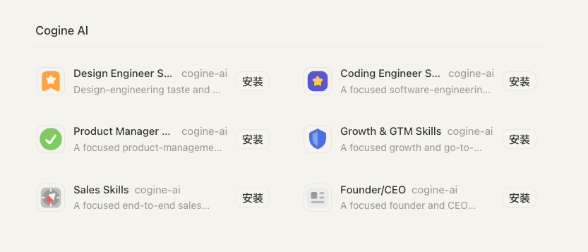

# Cogine AI Marketplace

A curated internal marketplace of role-based skills for Codex and Claude Code.

## Install the Marketplace

### Codex (recommended)

```bash
codex plugin marketplace add cogine-ai/marketplace
```

Then open **Plugins**, choose **Cogine AI**, and install only the role plugins
you want. If the Marketplace does not appear immediately, restart Codex once.



### Claude Code

```bash
claude plugin marketplace add cogine-ai/marketplace
```

Adding the Marketplace registers its catalog; it does not install every plugin.
This is a private repository, so Git must already have access to
`cogine-ai/marketplace`.

## Available plugins

| Plugin | Skills | Focus |
| --- | ---: | --- |
| `design-engineer-skills` | 6 | UI polish, animation review, and motion design. |
| `coding-engineer-skills` | 24 | Specs, implementation, frontend and React work, architecture, debugging, testing, security, Git/CI, and multi-repository orchestration. |
| `product-manager-skills` | 16 | Strategy, product judgment, discovery, research, PRDs, prototypes, roadmaps, metrics, design, specs, and tickets. |
| `growth-and-gtm-skills` | 18 | Product marketing, growth models, channels, acquisition, conversion, retention, measurement, PLG sales assist, and recurring execution. |
| `sales-skills` | 12 | Founder-led selling, first customers, prospecting, outreach, calls, enablement, enterprise accounts, pipeline review, and PLG sales integration. |
| `founder-ceo-skills` | 16 | Founder judgment, product-market fit, strategy, decisions, planning, organization, finance, fundraising, and board communication. |

Install any plugin from the table with its ID:

```bash
# Codex
codex plugin add coding-engineer-skills@cogine-ai

# Claude Code
claude plugin install coding-engineer-skills@cogine-ai
```

In an existing Claude Code session, run `/reload-plugins` after installation.

## Compatibility

Codex is the primary target. The repository also ships native Claude Code
manifests while sharing the same skill folders:

- Codex catalog: `.agents/plugins/marketplace.json`
- Codex manifests: `plugins/*/.codex-plugin/plugin.json`
- Claude Code catalog: `.claude-plugin/marketplace.json`
- Claude Code manifests: `plugins/*/.claude-plugin/plugin.json`

## Update

```bash
codex plugin marketplace upgrade cogine-ai
claude plugin marketplace update cogine-ai
```

## Repository layout

```text
.agents/plugins/marketplace.json       # Codex catalog
.claude-plugin/marketplace.json        # Claude Code catalog
docs/images/                           # Marketplace screenshots
plugins/design-engineer-skills/
  .codex-plugin/plugin.json            # Codex manifest
  .claude-plugin/plugin.json           # Claude Code manifest
  skills/                              # 6 shared skills
plugins/coding-engineer-skills/
  .codex-plugin/plugin.json            # Codex manifest
  .claude-plugin/plugin.json           # Claude Code manifest
  skills/                              # 24 shared skills
plugins/product-manager-skills/
  .codex-plugin/plugin.json            # Codex manifest
  .claude-plugin/plugin.json           # Claude Code manifest
  skills/                              # 16 shared skills
plugins/growth-and-gtm-skills/
  .codex-plugin/plugin.json            # Codex manifest
  .claude-plugin/plugin.json           # Claude Code manifest
  skills/                              # 18 shared skills
plugins/sales-skills/
  .codex-plugin/plugin.json            # Codex manifest
  .claude-plugin/plugin.json           # Claude Code manifest
  skills/                              # 12 shared skills
plugins/founder-ceo-skills/
  .codex-plugin/plugin.json            # Codex manifest
  .claude-plugin/plugin.json           # Claude Code manifest
  skills/                              # 16 shared skills
```
