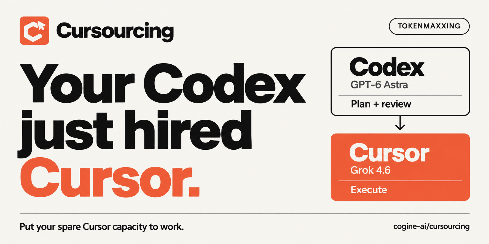

[](https://github.com/cogine-ai/cursourcing)

<p align="center">
  <strong>让 Cursor 执行子任务，由 Codex 负责规划、跟进和验收。</strong><br />
  <a href="#安装">安装 Cursourcing</a> ·
  <a href="https://github.com/cogine-ai/marketplace">Cogine AI Marketplace</a> ·
  <a href="README.md">English</a>
</p>

## Astra × Grok，新一代 tokenmaxxing。

**Codex 里的 GPT-6 Astra 快不够用了，Cursor 里的 Grok 4.6 却还有余量。** 让这份余量干起活来。

**Cursourcing = Cursor + outsourcing。** Astra 负责规划、判断和验收；适合委托的子任务，由 Codex 交给 Cursor 里的 Grok 4.6 执行，再把结果接回来。

你继续在 Codex 里工作，两边的订阅都用起来。

| Codex 规划 | Cursor 执行 | Codex 验收 |
| --- | --- | --- |
| 选择适合委托的子任务，提供上下文。 | 在指定项目目录中执行，反馈进展和问题。 | 检查改动与结果，需要时继续追问或修正。 |

Codex 主模型保持你的选择。当前 Cursor 执行配置为 **Grok 4.6 · xhigh · fast**。

## 安装

需要支持插件的 Codex、Node.js 22+，以及已安装并登录的 [Cursor CLI](https://cursor.com/docs/cli/overview)。尚未登录时，先运行 `agent login`。Cursor 账号需要能够使用上述 Grok 模型。

### 1. 添加 Cogine AI Marketplace

```bash
codex plugin marketplace add cogine-ai/marketplace
```

如果已经添加，运行 `codex plugin marketplace upgrade cogine-ai` 更新目录。

### 2. 安装 Cursourcing

在 Codex 应用中进入 **Plugins → Cogine AI → Cursourcing** 安装，也可以执行：

```bash
codex plugin add cursourcing@cogine-ai
```

运行文件已打包，安装时无需克隆源码、执行 `npm install` 或构建。

### 3. 用真实任务开始

在项目中新开一个 Codex 任务，引用 **`$cursourcing:cursourcing`**，例如：

```text
使用 $cursourcing 规划这个任务，主动把适合的工作交给 Cursor，
跟进执行并检查结果。
```

Codex 会正常分析和规划，主动寻找可委托的工作；调查和方案探索也可以交给 Cursor，不必先确定每个实现细节。引用技能不意味着马上委托。

**[浏览 Cogine AI Marketplace 的全部七个插件 →](https://github.com/cogine-ai/marketplace#available-plugins)**

## 给 Cursor 的余量安排点工作

- **范围明确的实现**：按已确定的方案改动相关文件，运行适当检查，汇报结果。
- **带证据的调查**：追踪故障，收集代码与运行证据，交回 Codex 判断。
- **相互独立的工作**：在合适的目录或 worktree 中并行运行多个 Cursor 会话。
- **同一任务的后续修正**：保留 Cursor 会话，根据验收意见继续工作。

哪些直接完成、哪些交给 Cursor，由 Codex 随任务推进判断。原生子代理和其他协作方式仍然可用。

## 交得出去，也接得回来

| 能力 | 实际体验 |
| --- | --- |
| 异步执行 | Cursor 启动时先返回任务 ID，Codex 可以继续检查进度、随后收取结果。 |
| 问题与权限请求 | 请求会返回给 Codex，由它根据已有授权处理，必要时再请你决定。 |
| 精简结果 | 默认读取进度、最新回复和关键信息，详细原生历史按需加载。 |
| 会话恢复 | 重新加载保存的对话，继续后续工作，不会自动重跑中断前的指令。 |
| 主代理验收 | Cursor 一轮结束后，Codex 仍需检查实际改动与结果。 |

## 常见问题

**额度怎么消耗？** Codex 与 Cursor 各自使用自己的账号和额度，插件在两者之间委托工作，不转移 token。Codex 的规划、跟进和验收仍然消耗额度，实际收益取决于任务和分工。

**一定要用 Astra 吗？** Astra 是这个插件的出发点，主任务仍可使用你选择的其他 Codex 模型。

**会强制所有工作都交给 Cursor 吗？** 不会。技能保持正常可发现，由 Codex 判断何时委托。插件不安装 Hooks，也不禁用原生子代理。

**关闭 Codex 后还能继续跑吗？** 当前版本随 MCP 进程运行。该进程退出时，执行中的任务会中断，保存的会话可以恢复；插件不会独立唤醒空闲的 Codex 任务。

**Cursor 在哪个目录工作？** Codex 传入的绝对目录，也可以是具体 worktree。插件不会自动创建 worktree。

**能改 Cursor 使用的模型吗？** 当前版本固定使用 Grok 4.6、xhigh 和 fast；配置不可用时会明确报错。

## 更新

```bash
codex plugin marketplace upgrade cogine-ai
codex plugin add cursourcing@cogine-ai
```

更新后新开任务，以加载最新的技能与工具。

## 更多资料

- [运行机制、权限、配置和历史记录](docs/runtime.md)
- [开发与验证](docs/development.md)
- [图标与分享封面](docs/brand.md)
- [反馈问题或建议](https://github.com/cogine-ai/cursourcing/issues)
- [Cogine AI Marketplace](https://github.com/cogine-ai/marketplace)

## 开源许可

Cursourcing 的原创内容采用 [Apache-2.0](LICENSE) 许可证，版权归 2026 [Cogine AI](https://github.com/cogine-ai) 所有，署名信息见 [NOTICE](NOTICE)。打包的第三方依赖保留各自的许可证，详见 [THIRD_PARTY_NOTICES.md](dist/THIRD_PARTY_NOTICES.md)。

由 [Cogine AI](https://github.com/cogine-ai) 制作。如果你也认识 Codex 先用完、Cursor 还剩不少的朋友，把这个仓库发给他。
